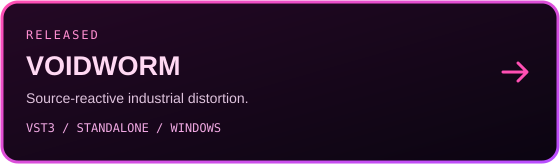
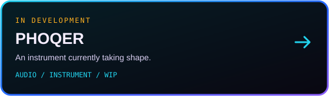

<div align="center">



<a href="https://github.com/lew0nn">
  
</a>

<p>
  <a href="https://github.com/lew0nn"></a>
  <a href="https://github.com/lew0nn?tab=followers"></a>
  <a href="#projects"></a>
</p>

<p>
  <a href="https://github.com/lew0nn"></a>
  <a href="https://open.spotify.com/user/31tkdf56o4ybejfgvodwd2jy6ahi"></a>
  <a href="https://discord.com/users/lewonn"></a>
</p>

</div>

<br />

## About

```yaml
name:      "lewonn"
role:      "Audio Software Developer"
focus:     ["audio plug-ins", "instruments", "real-time DSP"]
stack:     ["C++", "JUCE", "CMake"]
```

I build audio software where signal processing, interface design, and controlled instability meet. The machinery can be complicated; using it should not be.

<br />

## Stack

<div align="center">

<a href="https://isocpp.org/"></a>
<a href="https://juce.com/"></a>
<a href="https://en.wikipedia.org/wiki/Digital_signal_processing"></a>
<a href="https://steinbergmedia.github.io/vst3_dev_portal/"></a>
<a href="https://cmake.org/"></a>
<a href="https://developer.microsoft.com/windows/"></a>
<a href="https://github.com/features/actions"></a>

</div>

<br />

## Projects

<div align="center">

<a href="https://github.com/lew0nn/voidworm"></a>
<a href="https://github.com/lew0nn/phoqer"></a>

</div>

<br />

## Recent rotation

<div align="center">

<a href="https://open.spotify.com/user/31tkdf56o4ybejfgvodwd2jy6ahi">
  
</a>

</div>

<br />

## GitHub

<div align="center">

<a href="https://github.com/lew0nn"></a>
<a href="https://github.com/lew0nn"></a>

</div>

<br />

<div align="center">


<br /><br />

<sub>building things that react, distort, and stay playable</sub>

</div>
