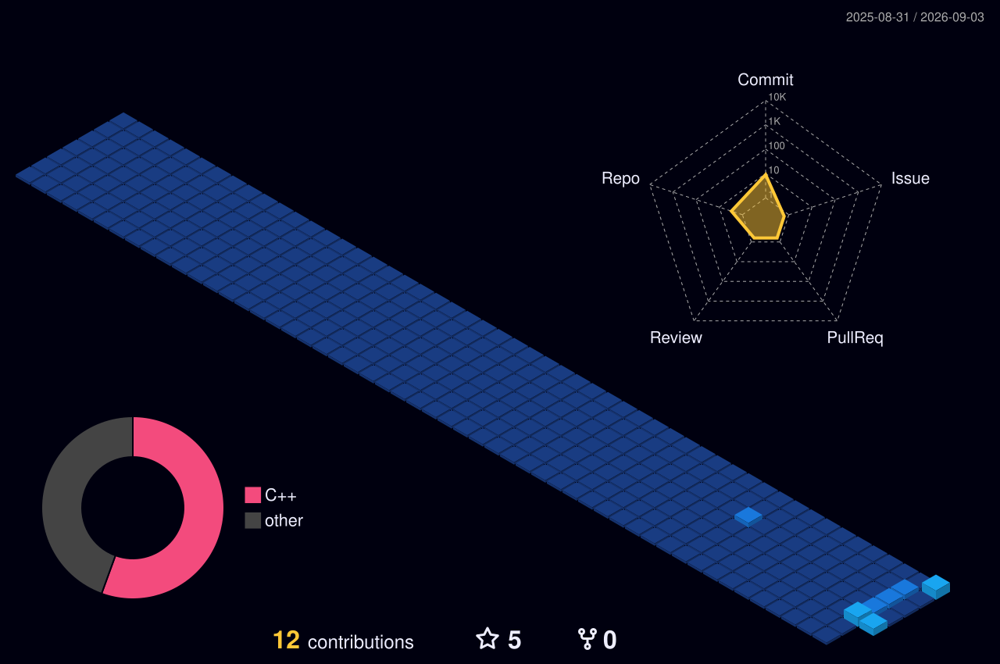

<div align="center">
  

  <br />

  <samp>building software that listens before it reacts</samp>

  <br /><br />

  <a href="https://github.com/lew0nn/voidworm"></a>
  
  

  <br /><br />

  <a href="https://github.com/lew0nn?tab=repositories">PROJECTS</a>
  &nbsp;&nbsp;·&nbsp;&nbsp;
  <a href="https://github.com/lew0nn/voidworm">VOIDWORM</a>
  &nbsp;&nbsp;·&nbsp;&nbsp;
  <a href="https://github.com/lew0nn/voidworm/releases">RELEASES</a>
</div>

<br />

## `00 / IDENTITY`

<table>
  <tr>
    <td width="60%" valign="top">
      <h3>I make instruments for controlled damage.</h3>
      <p>I'm <strong>lewonn</strong>. I build audio plug-ins and the occasional piece of software that escapes the studio. My current work sits between real-time DSP, native C++, and interfaces that explain the sound without getting in its way.</p>
      <p>The goal is not complexity on display. It is complicated machinery that still feels immediate when you touch it.</p>
    </td>
    <td width="40%" valign="top">
      <pre>LOCATION   inside the signal chain
LANGUAGE   C++
DOMAIN     real-time audio / DSP
OUTPUT     VST3 + standalone
PLATFORM   Windows
STATUS     developing random ideas</pre>
    </td>
  </tr>
</table>

```text
SOURCE  ──►  ANALYZE  ──►  DESTABILIZE  ──►  CONTAIN  ──►  PLAY
```

## `01 / ACTIVE CHANNELS`

<table>
  <tr>
    <td width="50%" valign="top">
      <h3><a href="https://github.com/lew0nn/voidworm">VOIDWORM</a> <sup>LIVE</sup></h3>
      <p>Source-reactive industrial distortion. Four parallel reactors follow the incoming material and turn it into controlled movement instead of repeating the same static damage.</p>
      <p><code>C++17</code> <code>JUCE 8</code> <code>VST3</code> <code>Standalone</code></p>
      <p><a href="https://github.com/lew0nn/voidworm">source</a> · <a href="https://github.com/lew0nn/voidworm/releases">downloads</a></p>
    </td>
    <td width="50%" valign="top">
      <h3>PHOQER <sup>BUILDING</sup></h3>
      <p>An instrument currently taking shape behind the panel. Details stay quiet until the signal is worth transmitting.</p>
      <p><code>INSTRUMENT</code> <code>IN DEVELOPMENT</code></p>
      <p><em>more when it is ready</em></p>
    </td>
  </tr>
</table>

## `02 / RACK MAP`

<div align="center">

**ENGINE**


**BUILD & DELIVERY**


</div>

## `03 / TELEMETRY`

<div align="center">
  
  <br />
  
  
</div>

## `04 / CONTRIBUTION TERRAIN`

<div align="center">
  
  <br />
  <sub>rebuilt automatically from public GitHub activity</sub>
</div>

<br />

<div align="center">
  
</div>
