<div align="center">


<a href="https://github.com/lew0nn">
  
</a>

<p>
  
  <a href="https://github.com/lew0nn?tab=followers"></a>
  
</p>

<a href="https://github.com/lew0nn">profile</a>
&nbsp;·&nbsp;
<a href="https://github.com/lew0nn?tab=repositories">projects</a>
&nbsp;·&nbsp;
<a href="https://github.com/lew0nn/voidworm/releases">releases</a>

</div>

<br />


## About

```yaml
name:      "lewonn"
role:      "Audio Software Developer"
focus:     ["audio plug-ins", "instruments", "real-time DSP"]
stack:     ["C++", "JUCE", "CMake"]
shipping:  "VOIDWORM"
building:  "PHOQER"
```

I build audio software where signal processing, interface design, and controlled instability meet. The machinery can be complicated; using it should not be.

<br />

## Stack

<div align="center">


</div>

<br />

## Projects

### [VOIDWORM](https://github.com/lew0nn/voidworm) · `released`

Source-reactive industrial distortion with four parallel reactors. VST3 and Standalone for Windows.

[source](https://github.com/lew0nn/voidworm) · [download](https://github.com/lew0nn/voidworm/releases)

### PHOQER · `in development`

An instrument currently taking shape. More when it is ready.

<br />

## Recent rotation

<div align="center">

<a href="https://open.spotify.com/user/31tkdf56o4ybejfgvodwd2jy6ahi">
  
</a>

</div>

<br />

## GitHub

<div align="center">


</div>

<br />

## Contributions

<div align="center">

<picture>
  <source media="(prefers-color-scheme: dark)" srcset="./assets/github-snake-dark.svg" />
  <source media="(prefers-color-scheme: light)" srcset="./assets/github-snake.svg" />
  
</picture>

<br /><br />

<sub>building things that react, distort, and stay playable</sub>

</div>
