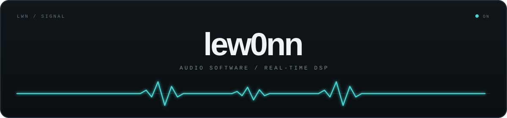
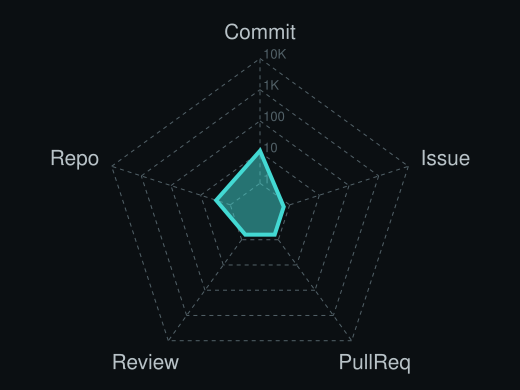

  

   

  <samp>audio software · real-time dsp · controlled damage</samp>

    

  <a href="https://github.com/lew0nn?tab=repositories">work</a>
  &nbsp;·&nbsp;
  <a href="https://github.com/lew0nn/voidworm">voidworm</a>
  &nbsp;·&nbsp;
  <a href="https://github.com/lew0nn/voidworm/releases">releases</a>

 

### `01 / about`

I'm **lewonn**. I build audio plug-ins and instruments in C++, with a focus on reactive DSP and interfaces that keep complex systems playable.

> The machinery can be complicated. Using it should not be.

### `02 / work`

| project | state | signal |
| :-- | :-- | :-- |
| [**VOIDWORM**](https://github.com/lew0nn/voidworm) | `released` | source-reactive industrial distortion · [download](https://github.com/lew0nn/voidworm/releases) |
| **PHOQER** | `building` | an instrument in development |

### `03 / tools`

  <code>C++</code>&nbsp;&nbsp;
  <code>JUCE</code>&nbsp;&nbsp;
  <code>DSP</code>&nbsp;&nbsp;
  <code>VST3</code>&nbsp;&nbsp;
  <code>CMake</code>&nbsp;&nbsp;
  <code>Windows</code>

### `04 / signal`

  
    
  

 

  

